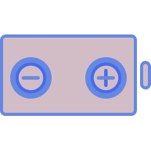

# Charge Control Chrome Extension

<h1 align="center">
	
	 
	 
</h1>

> Keep your lithium-ion battery healthy, easily

## Description
An extension of [battery-info-chrome-extension](https://github.com/radibit/battery-info-chrome-extension) by [radibit](https://github.com/radibit).

This extension extends the functionality of [radibit's](https://github.com/radibit) by allowing you to automatically turn a smart outlet on/off at certain charge percentages. This will let you optimize the lifespan of your li-ion batteries!

[According to battery university](https://batteryuniversity.com/learn/article/how_to_prolong_lithium_based_batteries), reducing the depth of discharge of your lithium ion battery from 100% to 10% can increase it's longevity by up to 25,000%!

The extension is using the [Battery Status API](https://developer.mozilla.org/en-US/docs/Web/API/Battery_Status_API).

## Usage Requirements:
* Smart Outlets: I'm using [Smart Plug, Gosund Mini WiFi Outlet](https://smile.amazon.com/gp/product/B079MFTYMV/ref=ppx_yo_dt_b_asin_title_o03_s00?ie=UTF8&psc=1). But any smart plug that can interact with [IFTT](https://ifttt.com/) should work.
* IFTT Webhooks: You'll need to create [IFTT](https://ifttt.com/) applets with webhook triggers. Get your webhook key by pressing the "Documentation" button on the top right of [this](https://maker.ifttt.com/use) page.
* For setup, please refer to the [wiki](https://github.com/allen-n/charge-control-chrome-extension/wiki).

## Features:
### New Functionality:
- Configurable options menu to set max charge level, min charge level, and webhook information to trigger charger on/off events
- 
- Turn charge controller on/off with slider (i.e. when you want to top off before unplugging for the day)
- 
- 

### Old functionality (from [battery-info-chrome-extension](https://github.com/radibit/battery-info-chrome-extension)):
- Shows current battery charge level as a badge on the icon (updates on every two minutes)
- Provides information about the remaining time / time until full charge (on icon click)
- Indicates with an icon whether or not the laptop is connected to a power adapter

## Detailed Usage Instructions
Copied from the [wiki](https://github.com/allen-n/charge-control-chrome-extension/wiki)

1.  Getting the smart outlets: I'm using [Smart Plug, Gosund Mini WiFi Outlet](https://smile.amazon.com/gp/product/B079MFTYMV/ref=ppx_yo_dt_b_asin_title_o03_s00?ie=UTF8&psc=1). But any smart plug that can interact with [IFTT](https://ifttt.com/) should work. The rest of this walkthrough will assume you're using these outlets, but the steps should be easily transferrable if you aren't.
2. [Log in](https://ifttt.com/) or [create](https://ifttt.com/join) an IFTT account.
3. [Create your applet](https://ifttt.com/create). You should see "If _This_ then _that_ on the screen.
4. Click _This_ and search for "webhooks". Click it, then click "receive web request". Then you'll want to give it a name, something like "outlet_off" will do. Just don't put blank spaces like " " in the name! 
5. Now select _that_. 
6. Search for your smart outlet developer. For GoSund, search for "smart life".
5. Log in with your GoSund account, and select the off event (you'll do "on" for the second event). 
6. Select the outlet you want to control from the menu, create the event, uncheck "Receive notifications when this applet runs, and click finish. 
7. Repeat steps 3-6, but this time naming the event something along the lines of "outlet_on" in step 4, and selecting the off event in step 5. You now have your two event names!
8. Get your API key by clicking "documentation on [this page](https://ifttt.com/maker_webhooks). 
9. The string at the top of your page after "Your key is:" is your key, record it!
10. Open the extension menu, click "options", and add the information as follows: webhook API key is the key from step 8, 
"Turn On" Event Name is the event name with "on" in it from the second time you did step 4, and "Turn Off" Event Name is the event name with "off" in it from the first time you did step 4. 
11. Press save, and you're ready to roll! Test the outlet control by clicking "Test Turn On/Off", which should turn your outlet on and off. If everything is working, you're set to go.
12. Don't forget to turn the extension off via the popup menu if you want to charge to 100% before a day out on the town :) 