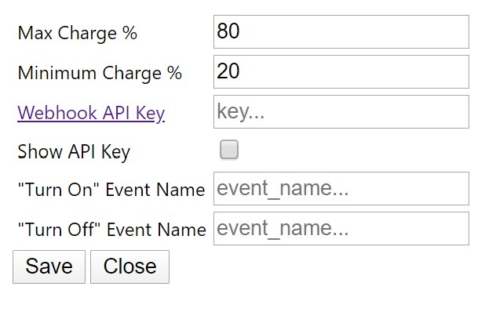
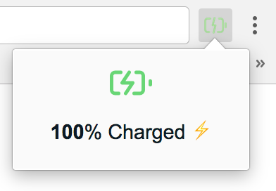
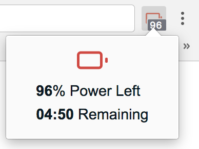

# Charge Control Chrome Extension

<h1 align="center">
	
	 
	 
</h1>

> Keep your lithium-ion battery healthy, easily

## Description
An extension of [battery-info-chrome-extension](https://github.com/radibit/battery-info-chrome-extension) by [radibit](https://github.com/radibit).

This extension extends the functionality of [radibit's](https://github.com/radibit) by allowing you to automatically turn a smart outlet on/off at certain charge percentages. This will let you optimize the lifespan of your li-ion batteries!

[According to battery university](https://batteryuniversity.com/learn/article/how_to_prolong_lithium_based_batteries), reducing the depth of discharge of your lithium ion battery from 100% to 10% can increase it's longevity by up to 25,000%!

The extension is using the [Battery Status API](https://developer.mozilla.org/en-US/docs/Web/API/Battery_Status_API).

## Usage Requirements:
* Smart Outlets: I'm using [Smart Plug, Gosund Mini WiFi Outlet](https://smile.amazon.com/gp/product/B079MFTYMV/ref=ppx_yo_dt_b_asin_title_o03_s00?ie=UTF8&psc=1). But any smart plug that can interact with [IFTT](https://ifttt.com/) should work.
* IFTT Webhooks: You'll need to create [IFTT](https://ifttt.com/) applets with webhook triggers. Get your webhook key by pressing the "Documentation" button on the top right of [this](https://maker.ifttt.com/use) page.
* For setup, please refer to the [wiki](https://github.com/allen-n/charge-control-chrome-extension/wiki).

## Features:
### New Functionality:
- Configurable options menu to set max charge level, min charge level, and webhook information to trigger charger on/off events

### Old functionality (from [battery-info-chrome-extension](https://github.com/radibit/battery-info-chrome-extension)):
- Shows current battery charge level as a badge on the icon (updates on every two minutes)
- Provides information about the remaining time / time until full charge (on icon click)
- Indicates with an icon whether or not the laptop is connected to a power adapter

